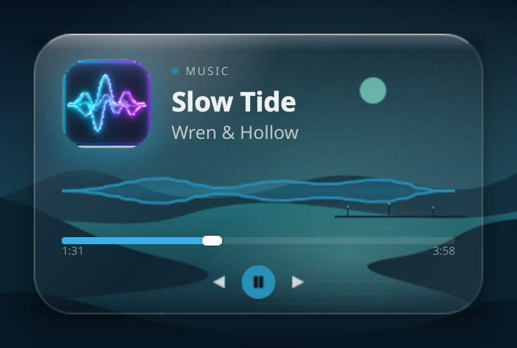
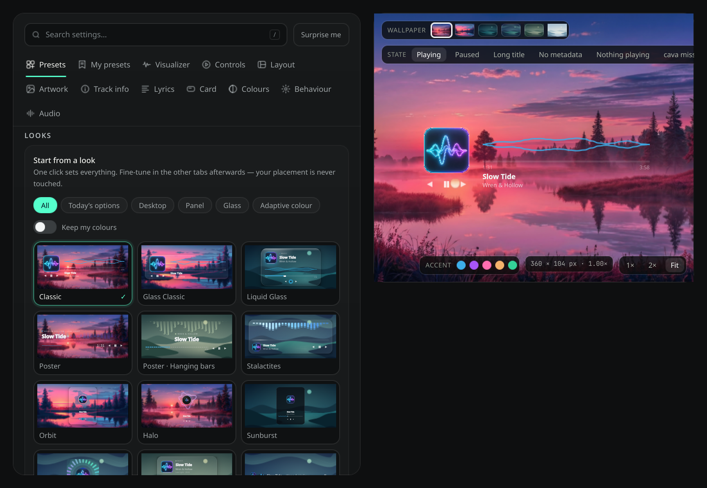

<p align="center">
  
</p>

<h1 align="center">Plasma Audio Wave Visualizer</h1>

<p align="center">
  <a href="https://www.opendesktop.org/p/2359422/">
    
  </a>
  
  
  <a href="https://www.opendesktop.org/p/2359422/">
    
  </a>
  <a href="https://github.com/Muddyblack/kde-audio-visualizer/releases">
    
  </a>
</p>

<p align="center">
  
</p>

<p align="center">
  <a href="#features">Features</a> ·
  <a href="#gallery">Gallery</a> ·
  <a href="#requirements">Requirements</a> ·
  <a href="#install">Install</a> ·
  <a href="#configuration">Configuration</a> ·
  <a href="#how-it-works">How it works</a> ·
  <a href="#credits--inspiration">Credits & Inspiration</a>
</p>

---

An audio visualizer for KDE Plasma 6 and Hyprland/Quickshell. Reacts to system-wide
audio through [cava], with album artwork, MPRIS playback controls and a live
settings studio for building your own look.

<p align="center">
  
</p>

## Features

**Visuals** — 16 visualizers from smooth waves and bars to ribbons, particles and
Pulse Orb; 6 palettes with reactive hues, glow and bloom; system, custom or
cover-driven accents.

**Layouts** — Classic, mirrored, inline, hero, stacked, strip, poster and Orbit
cards, plus panel pills/icons. Album-cover backgrounds, glass/liquid styling,
card shadows, artwork effects and perspective tilt with stationary controls,
and a separate cover lightbox.

**Presets & studio** — 28 built-in presets plus a live studio with search,
visual pickers and your own saved looks. Export a look as JSON from the HTML
demo and import it into the widget, or go the other way.

**Playback** — Play/pause, skip, seeking, supported shuffle/repeat and player
switching. Optional album/details and scrolling titles. Opt-in synced lyrics,
including a **Lyrics only** layout: readable, wrapped verses with the current
line highlighted. Scroll to read ahead, then choose **Follow current line** to
resume. Find it under **Lyrics → Lyrics only**, **Layout**, or **Presets**; it
uses online lyrics from LRCLIB.

**Efficiency** — Reduced motion, battery saver, idle/paused states and
hidden-widget audio suspension. Shared QML components across Plasma and
Quickshell, with shader and software renderers.

Two current limits: glass/liquid styling does not yet sample or refract the
desktop behind the widget, and the Orbit shaders are still pending a desktop
visual/power pass.

## Gallery

Real QML screenshots with sample playback and the original 1024px widget icon.
Presets are rendered side by side into one capture per family at 2× resolution —
no rescaling, no collage afterwards. These captures use Qt’s software renderer;
GPU-only blur, reflection and shader effects require an OpenGL capture.


[Browse all 28 presets](docs/gallery.md) across seven sheets. Rebuild the gallery
and that page with `make gallery`.

To try the HTML demo locally, run `make docs`, then open `docs/website/index.html`.
The demo shares wallpapers, theme/catalogue data and preset exchange code with
QML; it has a separate browser renderer and uses sample playback.

## Requirements

- KDE Plasma **6.0+**
- [`cava`][cava] — the audio bar generator
- A running PipeWire or PulseAudio server (the widget auto-detects which one cava can capture from)
- `flock` (from `util-linux`) and `pkill` (from `procps`) — standard on virtually every Linux distro

[cava]: https://github.com/karlstav/cava

## Install

### Hyprland / Caelestia (Quickshell)

Run the standalone desktop widget alongside Caelestia. Both frontends render
the same `VisualizerView.qml`, layouts, artwork, transport controls,
16 visualizer styles and 11 progress styles.
Requires `qs` (Quickshell), `cava`,
and the shell utilities listed above; KDE Plasma is not required.

From this repository, in your Hyprland session:

```bash
make view-hyprland
# equivalent:
bash hyprland/run.sh
```

On NixOS, if `qs` is not on PATH, the Make target uses `nix run .#view-hyprland`
to supply Quickshell, cava, and the helper utilities automatically.

Play audio and show your desktop: the transparent visualizer appears centered
60% down the first monitor, below application windows. Stop with **Ctrl+C**.
Caelestia can keep running. The launcher opens the root `shell.qml`, prevents
duplicate instances, and stops its audio helpers when you exit.
The launcher selects Qt's generic platform theme and Basic controls for this
process only. This prevents an inherited KDE/Breeze theme from loading Kirigami
through tooltips; the shared custom-drawn widget layout is unaffected.

**Right-click the visualizer to open Settings.** Choose a monitor or **All displays**,
adjust position, size, audio, colors and appearance, then click **Apply**.
All displays share one audio capture and processing backend; each draws its own view.
The Hyprland default is **15 Hz** to reduce GPU/compositor work across displays.
In Settings → Audio, lower **Framerate** to **5 Hz** for less power use, or raise
it for smoother motion. Explicit saved/declarative frame rates override this
default. The layout, colors and drawing code are shared with Plasma.
**Pause When Covered** is enabled by default: each fully covered view stops
rendering, and covering all views also stops audio capture. Uncovering a view
resumes it; window drags are checked once per second. Coverage uses window
bounds, so disable this option if you want the widget visible through translucent
windows. It applies only when the widget is below application windows.
Preferences are saved to `~/.config/audio-wave-visualizer/hyprland.json`
(or under `$XDG_CONFIG_HOME`). No Nix setup is needed.

If the widget is hidden, open Settings from a terminal with:

```bash
make settings-hyprland
```

You can also edit `shell.qml` to set defaults for width, vertical position, monitor name, color,
wave style, background, or media controls; Quickshell reloads automatically.
Set `desktopLayer: false` to show it above application windows while testing.
For audio tuning, add e.g. `audio.sensitivity: 150` or `audio.inputMethod: "pulse"`
inside `AudioVisualizerShell { ... }`. Appearance defaults come directly from
Plasma's `package/contents/config/main.xml`. Override any of them with `settings`,
using the same property names, for example:

```qml
settings: ({
    alwaysVisible: true,
    showBg: true,
    artBg: true,
    progressBarStyle: 4
})
```

The default size is Plasma's 360 × 104; change `widgetWidth` / `widgetHeight`
as needed. Matching size, settings, colors, font and icon theme gives the same
appearance. Plasma supplies its theme through Kirigami; Quickshell uses the
configured colors and the session's font/icon theme, without requiring Kirigami.
Both hosts use the same settings studio inside their own configuration windows.

For declarative defaults, set `AUDIO_WAVE_DEFAULTS` to a JSON file with the same
keys as the settings above, plus `monitor` (`"all"`, `""`, or an output name),
`widgetWidth`, `widgetHeight`, `verticalPosition`, `desktopLayer`, `pauseWhenCovered`, `waveColor`,
and `textColor`. For example, in Home Manager:

```nix
home.sessionVariables.AUDIO_WAVE_DEFAULTS = toString (pkgs.writeText "audio-wave-defaults.json"
  (builtins.toJSON {
    monitor = "all";
    sensitivity = 150;
    progressBarStyle = 4;
  }));
```

The running widget must inherit that environment variable. GUI changes override
these defaults in the separate writable preferences file; they never rewrite
your Nix files. **Reset to defaults** removes local overrides and restores the
current declarative defaults (or `shell.qml`/Plasma defaults when none are supplied).

To start at login, add this to your Hyprland configuration (use your actual path):

```ini
exec-once = bash /absolute/path/to/plasma-audio-visualizer/hyprland/run.sh
```

The Quickshell backend keeps its status and `cava.log` under
`$XDG_RUNTIME_DIR/audio-wave-quickshell/`, separately from Plasma's backend.
Its process adapter uses [Quickshell Process](https://quickshell.org/docs/v0.2.0/types/Quickshell.Io/Process/)
and its controls use [Quickshell MPRIS](https://quickshell.org/docs/v0.2.0/types/Quickshell.Services.Mpris/MprisPlayer/).
Headless adapter regression test: `python3 tests/test_quickshell.py` with `qs` on PATH.
Settings UI/persistence test: `python3 tests/test_hyprland_settings.py`.
Ctrl+C/duplicate-launch test: `python3 tests/test_lifecycle_power.py`.

The shared waveform uses one GPU glow effect instead of blurring each bar on
the CPU. Progress decorations follow audio updates instead of running a separate
continuous animation. Software rendering omits the unsupported GPU glow.
For a repeatable CPU comparison against a saved older package, run
`python3 tools/benchmark_rendering.py --baseline /path/to/older/package`.
`python3 tools/benchmark_frames.py` measures the current view's frame submissions.
These offscreen benchmarks measure CPU drawing and frame submissions, not GPU
cost or system power; compare actual watts in your desktop session.
`python3 tools/measure_power.py` reads live package power, GPU clocks and capture
status without root. Compare the same music and visible displays, with other
work kept steady. Hardware domains overlap, so their watt readings must not be
added together. Turning off waveform glow alone does not necessarily reduce
compositor power; update rate and the number of visible displays matter too.
For a renderer investigation, stop the preview and start it with
`QSG_INFO=1 make view-hyprland`. Qt records its actual graphics backend and
render-loop startup details in that instance's Quickshell log.

### KDE Plasma

<details open>
  <summary><b>Manual (any distro)</b></summary>

```bash
git clone https://github.com/muddyblack/plasma-audio-visualizer.git
cd plasma-audio-visualizer
kpackagetool6 -t Plasma/Applet -i package
# or, to update an existing install:
kpackagetool6 -t Plasma/Applet -u package
```

Then add the widget from Plasma's **Add Widgets** panel.

To remove:

```bash
kpackagetool6 -t Plasma/Applet -r org.muddyblack.plasmaAudioVisualizer
```

</details>

<details>
  <summary><b>NixOS (flake)</b></summary>

```nix
# flake.nix
{
  inputs.audio-wave.url = "github:muddyblack/plasma-audio-visualizer";

  outputs = { self, nixpkgs, audio-wave, ... }: {
    nixosConfigurations.mybox = nixpkgs.lib.nixosSystem {
      modules = [
        ({ pkgs, ... }: {
          environment.systemPackages = [
            audio-wave.packages.${pkgs.system}.default
            pkgs.cava
          ];
        })
      ];
    };
  }
}
```

</details>

<details>
  <summary><b>Package as <code>.plasmoid</code> (for the KDE Store)</b></summary>

```bash
./pack.sh
# produces plasma-audio-visualizer-<version>.plasmoid
```

</details>

## Configuration

Open the widget's settings (right-click in Quickshell). The studio previews your
changes while you edit; **Apply/OK** commits them and **Cancel** discards them.
The charcoal interface uses Midnight Marina accents; widget colours are independent.



| Tab | Settings |
|---|---|
| Presets / My presets | Built-in looks, saved looks, JSON sharing, Keep my colours |
| Visualizer | Style, line weight, fill and style-specific controls |
| Controls | Progress, time labels, transport buttons and dock |
| Layout | Card/panel layout, sizing and text alignment |
| Artwork | Shape, scale, border, tilt, reflection and click action |
| Track info | Album, player, marquee and details |
| Lyrics | Line on card or lyrics-only mode; font, weight, spacing, alignment, colours, contrast, card size, reading position, following and timing offset |
| Card | Material, background, radius and depth |
| Colours | Accent sources, palettes, bloom, hue and text/control colours |
| Behaviour | Idle/paused states, reduced motion, battery saver; Hyprland placement |
| Audio | Input, bars, sensitivity, frame rate, smoothing and diagnostics |

### Share a look

1. In **My presets**, use **Copy as JSON** (HTML: **Copy current as JSON**).
2. In the other interface, choose **Import JSON** and paste it.
3. In QML, select the imported tile, then press **Apply** or **OK**.

Switch off **Keep my colours** to import the preset's colours as well. Placement
and your saved preset library stay local. The **Copy config** button in HTML
exports a different format; use the JSON preset buttons for sharing.

The preview's **Fit** shrinks large cards but does not enlarge beyond 1×; **2×**
is available explicitly. Plasma retains the outer widget rectangle while the
card scales proportionally inside it. Hyprland follows layout sizes while its
width/height remain at their defaults.

## Troubleshooting

**The bars never move (track info and controls work fine).**

The waveform comes from `cava`, which is a separate process from the MPRIS metadata — so
playback info can be perfect while audio capture is dead. The widget tells you which it is:
if the backend is down it prints the reason where the wave would be, with the command to fix
it underneath (`sudo apt install cava`, `sudo pacman -S cava`, … depending on your distro).
Hover the message for the full explanation.

Run the built-in diagnostic and paste its output into an issue:

```bash
bash ~/.local/share/plasma/plasmoids/org.muddyblack.plasmaAudioVisualizer/contents/code/doctor.sh
```

It reports your cava version, which input backends your cava was *built* with (distros
differ — a cava without PipeWire support cannot capture on a PipeWire system), whether
PipeWire/PulseAudio are running, and a live 2-second capture test per backend.

Common causes:

| Symptom | Fix |
|---|---|
| `cava is not installed` | The widget prints the install command for your package manager underneath. It retries every 30s, so no Plasma restart is needed unless your package manager only updates `PATH` for new sessions |
| `No usable audio input` | Check the doctor output — usually no sound server is reachable, or cava was built without the backend you need |
| Bars only move for one app | Nothing to fix: cava captures the default sink's monitor, so it follows system output |
| Everything works but bars are flat and quiet | Raise **Sensitivity** or lower **Smoothing** in the widget settings |

The feeder keeps a log of cava's own messages at `$XDG_RUNTIME_DIR/audio-wave-widget/cava.log`
and its current state in `.../status`.

## How it works

For a detailed explanation of the architecture and data flow, see the [Architecture Documentation](docs/workflow.md).

In short: a small shell helper (`feeder.sh`) runs `cava` in the background and writes each changed frame to `$XDG_RUNTIME_DIR/audio-wave-widget/`. The QML side reads it in-process at the configured frame rate, drops to 2 FPS after a few seconds of silence, and stops polling while the widget is hidden.

Waveforms and Orbit rings use bounded fragment-shader families on supported
scene graphs, with Canvas fallbacks for software sessions. Particle state advances
on the audio clock. Software covers use a static crop/mask fallback. After editing
a shader, run `make shaders`.

Regression tests (synthetic audio, no desktop or sound server needed): `nix develop --command python3 tests/run.py`.

## Credits & Inspiration

Special thanks to the following projects and creators that inspired features, visual ideas, and technical foundations for this widget:

- **[lumaribbon](https://github.com/Lucenx9/lumaribbon)** by [Lucenx9](https://github.com/Lucenx9) — Inspired the silk-ribbon visualizer behavior (bass-driven thickness, mids curvature, highs filaments, attack ripples, and silence fade), curated color palettes (Aurora, Ember, Ice, Grove, Iris, Coral), music-reactive hue drift, bloom effects, reduced motion / simple-render options, and live preview studio concepts.
- **[cava](https://github.com/karlstav/cava)** by [karlstav](https://github.com/karlstav) — The fast, lightweight audio bar generator and FFT backend powering the visualizer.
- **[LRCLIB](https://lrclib.net/)** — Synced lyrics database service powering the opt-in lyrics display.
