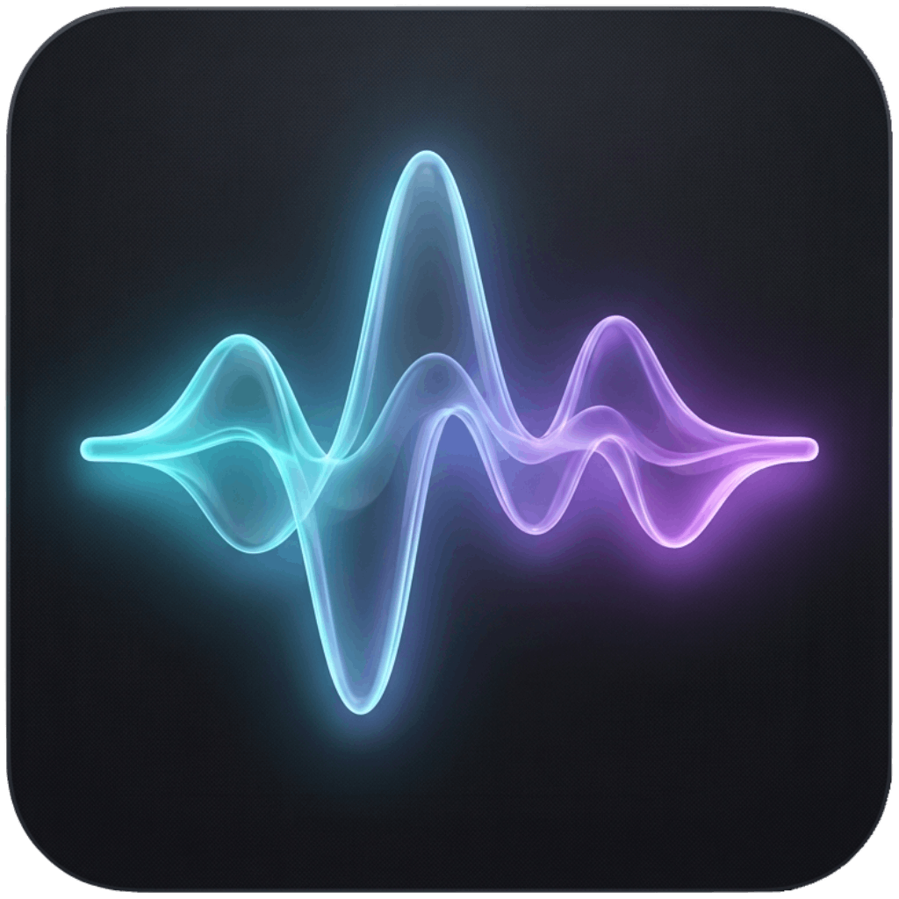
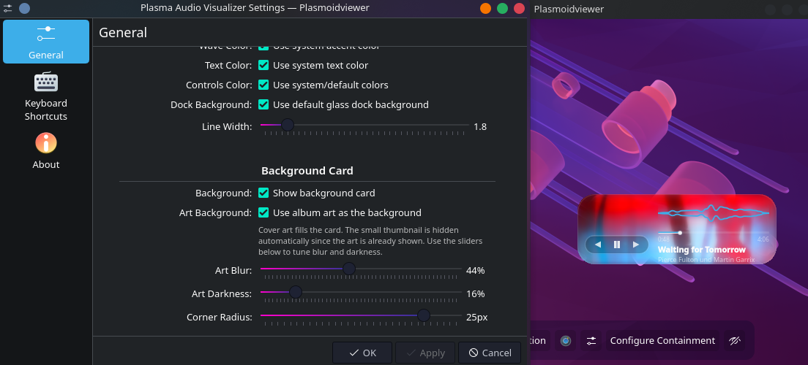

<p align="center">
  
</p>

<h1 align="center">Plasma Audio Wave Visualizer</h1>

<p align="center">
  <a href="https://www.opendesktop.org/p/2359422/">
    
  </a>
  
  
  <a href="https://www.opendesktop.org/p/2359422/">
    
  </a>
  <a href="https://github.com/Muddyblack/kde-audio-visualizer/releases">
    
  </a>
</p>

<p align="center">
  
</p>

<p align="center">
  <a href="#features">Features</a> ·
  <a href="#gallery">Gallery</a> ·
  <a href="#requirements">Requirements</a> ·
  <a href="#install">Install</a> ·
  <a href="#configuration">Configuration</a> ·
  <a href="#how-it-works">How it works</a>
</p>

---

A glassy audio visualizer plasmoid for KDE Plasma 6. Renders a mirrored waveform that reacts to whatever is playing system-wide (via [cava]), alongside MPRIS track metadata, album art, transport controls, and a seekable progress bar.

<p align="center">
  
</p>

## Features

- **6 visualizer styles** — Smooth Wave, Rounded Bars, Mirror Bars, Tech Line, Floating Dots, Floating Dots Bold
- **5 progress bar styles** — Glassy Sleek, Ultra Minimal, Glowing Pulse, Bold Pill, Waveform
- System-wide reactive waveform (PipeWire via cava — not tied to any single player)
- Smooth frame interpolation so the waveform glides instead of snapping
- MPRIS2 track info: title, artist, album art
- Transport controls (prev / play-pause / next) with customizable color
- Seekable progress bar with elapsed/total time
- Honors the active Plasma accent color (or set a custom color)
- Optional waveform fill + neon glow effect
- **Album art as background** — use the current cover as a blurred backdrop with independent Blur and Darkness sliders; the redundant thumbnail hides automatically
- Optional background card with configurable color, opacity (via alpha), and corner radius
- Custom text and controls colors
- Customizable dock background color (supports alpha via color picker)
- No panel background — sits cleanly on any panel

## Gallery

<details open>
  <summary><b>Smooth Wave / Lines</b></summary>
  <br/>
  
</details>

<details>
  <summary><b>Bars</b></summary>
  <br/>
  
</details>

<details>
  <summary><b>Dotted</b></summary>
  <br/>
  
</details>

<details>
  <summary><b>Album art as background</b></summary>
  <br/>
  Turn the current track's cover into a blurred backdrop. The album-art thumbnail
  hides automatically (it'd be redundant), and the <b>Blur</b> and <b>Darkness</b>
  sliders dial the look from a crisp bold cover to a subtle frosted tint — all
  while keeping the waveform and text readable.
  <br/><br/>
  
</details>

<details>
  <summary><b>Settings</b></summary>
  <br/>
  
</details>

## Requirements

- KDE Plasma **6.0+**
- [`cava`][cava] — the audio bar generator
- `flock` (from `util-linux`) and `pkill` (from `procps`) — standard on virtually every Linux distro

[cava]: https://github.com/karlstav/cava

## Install

<details open>
  <summary><b>Manual (any distro)</b></summary>

```bash
git clone https://github.com/muddyblack/plasma-audio-visualizer.git
cd plasma-audio-visualizer
kpackagetool6 -t Plasma/Applet -i package
# or, to update an existing install:
kpackagetool6 -t Plasma/Applet -u package
```

Then add the widget from Plasma's **Add Widgets** panel.

To remove:

```bash
kpackagetool6 -t Plasma/Applet -r org.muddyblack.plasmaAudioVisualizer
```

</details>

<details>
  <summary><b>NixOS (flake)</b></summary>

```nix
# flake.nix
{
  inputs.audio-wave.url = "github:muddyblack/plasma-audio-visualizer";

  outputs = { self, nixpkgs, audio-wave, ... }: {
    nixosConfigurations.mybox = nixpkgs.lib.nixosSystem {
      modules = [
        ({ pkgs, ... }: {
          environment.systemPackages = [
            audio-wave.packages.${pkgs.system}.default
            pkgs.cava
          ];
        })
      ];
    };
  }
}
```

</details>

<details>
  <summary><b>Package as <code>.plasmoid</code> (for the KDE Store)</b></summary>

```bash
./pack.sh
# produces plasma-audio-visualizer-<version>.plasmoid
```

</details>

## Configuration

All settings are available via the widget's right-click → Configure menu:

| Setting | Description |
|---|---|
| **Visualizer Style** | Smooth Wave / Rounded Bars / Mirror Bars / Tech Line / Floating Dots / Floating Dots Bold |
| **Progress Bar Style** | Glassy Sleek / Ultra Minimal / Glowing Pulse / Bold Pill / Waveform |
| **Number of Bars** | How many frequency bars cava outputs (8–128) |
| **Framerate** | Target refresh rate in Hz |
| **Sensitivity** | Cava amplitude multiplier |
| **Smoothing** | Noise reduction factor (0–1) |
| **Wave Color** | System accent or custom color |
| **Wave Glow** | Neon glow shadow on the waveform |
| **Fill Wave** | Transparent gradient fill under the waveform |
| **Line Width** | Stroke width for line-based visualizers |
| **Text / Controls / Dock Colors** | Each independently customizable |
| **Background Card** | Optional frosted card with custom color+alpha and corner radius |
| **Art Background** | Use the album cover as a blurred card background |
| **Art Blur / Art Darkness** | Independent sliders to tune how blurred and how dark the art background is |
| **Show MPRIS info** | Toggle album art, track title, artist, and controls |

## How it works

For a detailed explanation of the architecture and data flow, see the [Architecture Documentation](docs/workflow.md).

In short: the widget uses a small shell helper (`feeder.sh`) to run `cava` in the background and atomically writes the latest bars to `$XDG_RUNTIME_DIR/audio-wave-widget/bars`. The QML side polls that file at ~30 fps.