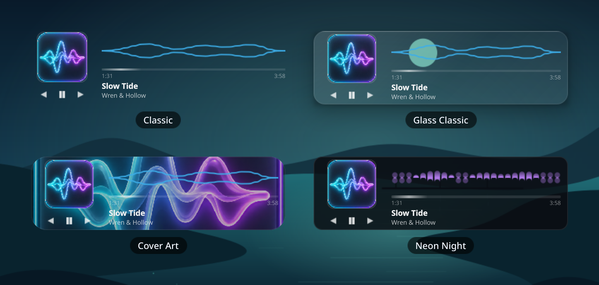
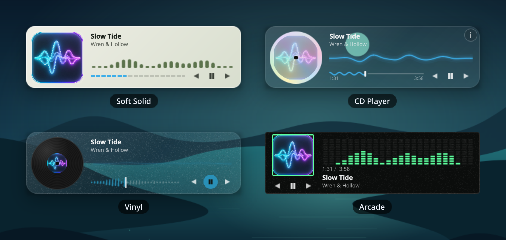
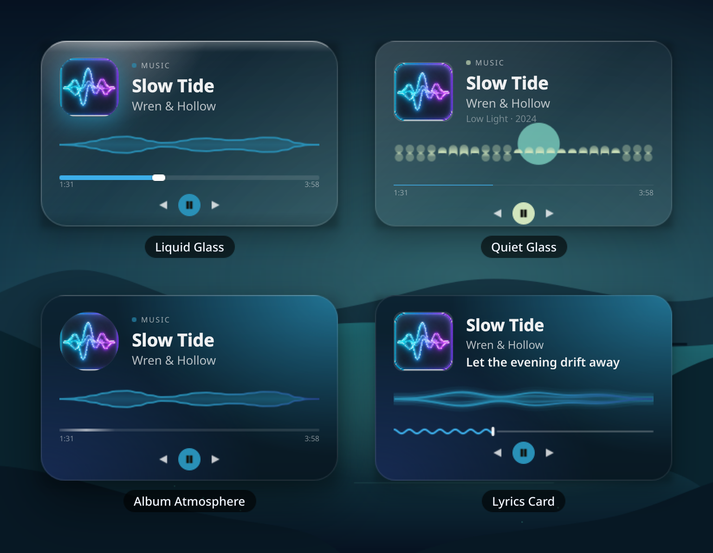
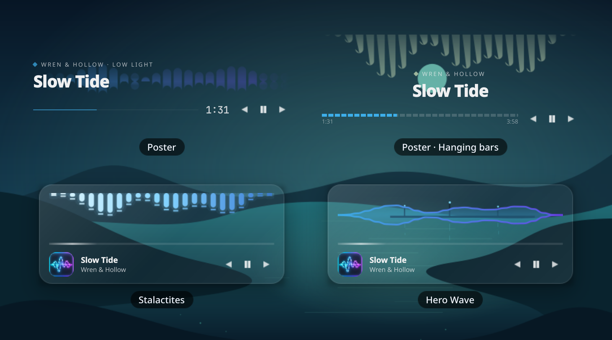
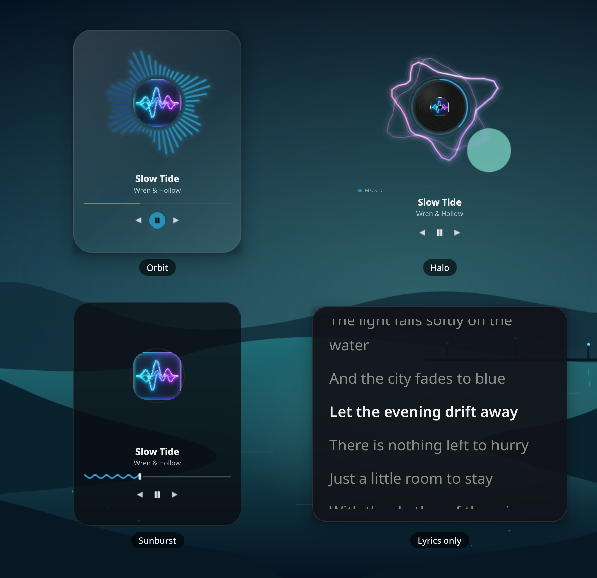
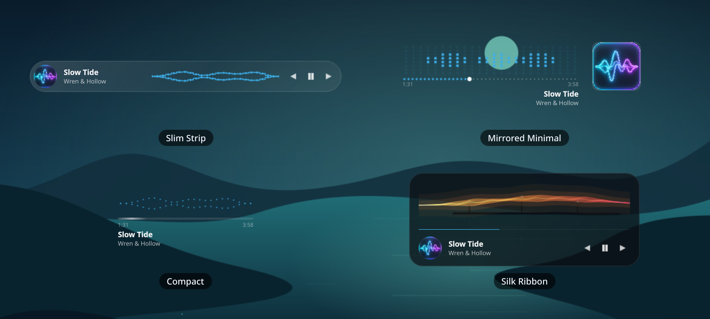
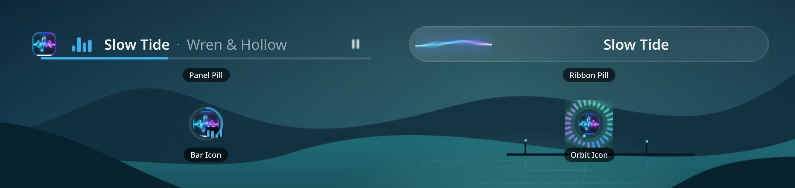

<!-- Generated by tools/capture_gallery.py; run `make gallery`. -->

# Preset gallery

Real QML screenshots with fixed sample audio and the original 1024px
widget icon. Each sheet is one capture: the presets are rendered together
at 2× resolution on a shared wallpaper, so nothing here is rescaled or
pasted together afterwards.

Rebuild with `make gallery`. These captures use Qt’s software renderer;
GPU-only blur, reflection and shader effects are omitted. For OpenGL
captures on a desktop, run
`make gallery GALLERY_FLAGS="--backend opengl --platform wayland"`.

## Classic cards

- **Classic** — Exactly today’s defaults — nothing changes for current users.
- **Glass Classic** — The layout people know, on a frosted card with a soft lift.
- **Cover Art** — Album art fills the card; the sharp thumbnail stays on top.
- **Neon Night** — Dark tint, mirror bars and the glowing pulse bar.

## Surfaces & players

- **Soft Solid** — Warm mineral surface and crisp dark text. No blur needed.
- **CD Player** — Spinning disc art, squiggle seek bar, flips over for track details.
- **Vinyl** — A record that spins while playing, sparkles, colour from the cover.
- **Arcade** — LED meter with hot peaks, pixel-sharp art, time-only readout.

## Stacked glass

- **Liquid Glass** — Clear glass, a light rim that follows your pointer, colour from the cover.
- **Quiet Glass** — Title leads, calm mirror bars, one soft accent, round play button.
- **Album Atmosphere** — Cover colours bleed into the card and drive the accent.
- **Lyrics Card** — Synced lyric line under the artist, Ribbon wave, cover palette.

## Posters & heroes

- **Poster** — The title set big, the music as a soft texture behind it, and a large clock.
- **Poster · Hanging bars** — A centred two-line title with bars hanging from the top edge behind it.
- **Stalactites** — Peak bars hang from the top edge and drip toward the title. Ice palette.
- **Hero Wave** — The visualizer takes the stage; track info tucks underneath.

## Orbits & lyrics

- **Orbit** — The cover is the centre; bars circle it, rotate slowly, and the cover breathes with the bass.
- **Halo** — A spinning record inside a soft ribbon halo, with a progress ring. Iris palette.
- **Sunburst** — Sparks fly off the cover on every beat. Ember palette on a dark tint.
- **Lyrics only** — Room to read: surrounding lines, a clear current line, and automatic scrolling. Online lyrics from LRCLIB.

## Slim & minimal

- **Slim Strip** — A wide, low bar for the bottom of the screen.
- **Mirrored Minimal** — Art on the right, dotted progress, no card, controls on hover.
- **Compact** — No art column — visualizer, progress and title only.
- **Silk Ribbon** — Bass thickens it, mids bend it, highs light the filaments. Ember palette.

## Panel layouts

- **Panel Pill** — Clean text pill for Plasma panels. Static EQ — zero animation cost.
- **Ribbon Pill** — A glowing silk ribbon living in the panel, Aurora palette.
- **Bar Icon** — Just the cover with a progress ring, for a Hyprland bar.
- **Orbit Icon** — A tiny radial ring around the cover, living in the bar.
