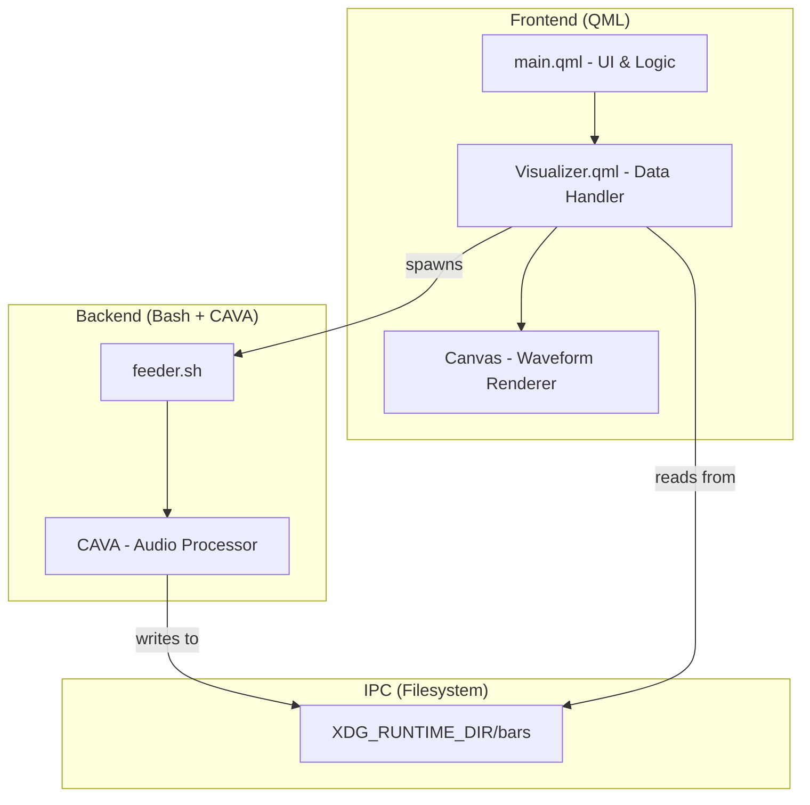
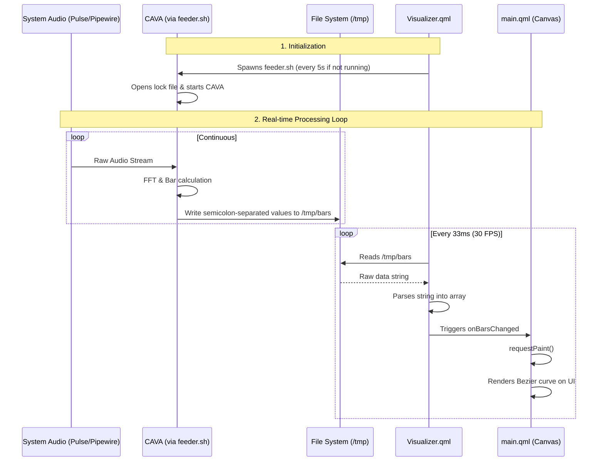

# Widget Workflow & Architecture

## Component Overview

The widget is split into three main layers: the **QML Frontend**, the **IPC Layer**, and the **Audio Backend**.

## Data Flow

The following sequence diagram shows how audio data moves from the system to your screen in real-time.

## Detailed Process breakdown

### 1. The Feeder (`feeder.sh`)
The feeder script acts as a bridge. It uses `cava` to process system audio and outputs raw data. It ensures only one instance of CAVA is running by using `flock`.

### 2. The Data Handler (`Visualizer.qml`)
This component is responsible for:
- Starting the feeder script.
- Periodically reading the bars data from the filesystem.
- Cleaning up the feeder process when the widget is destroyed.

### 3. The Renderer (`main.qml`)
The UI uses the HTML5-like `Canvas` API in QML to draw the waveform. It calculates a smooth Bezier curve based on the 24 frequency bars provided by the data handler.
