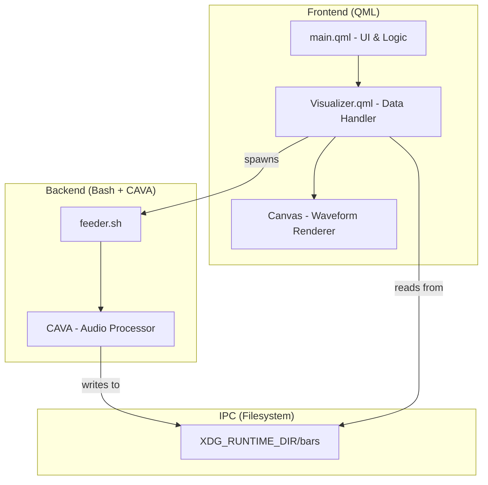
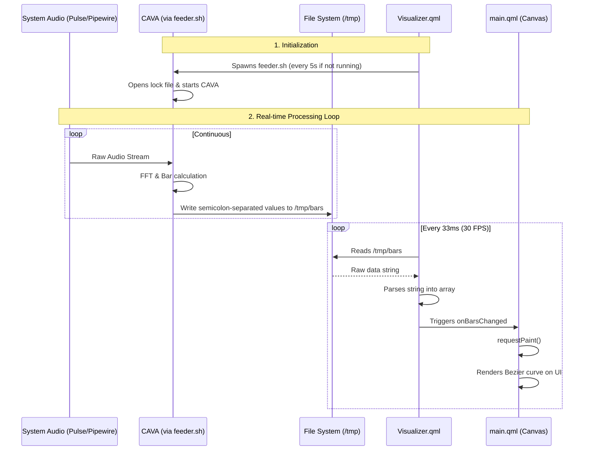

# Widget Workflow & Architecture

## Component Overview

The widget is split into three main layers: the **QML Frontend**, the **IPC Layer**, and the **Audio Backend**.

```mermaid
graph TD
    subgraph "Frontend (QML)"
        main[main.qml - UI & Logic]
        vis[Visualizer.qml - Data Handler]
        canvas[Canvas - Waveform Renderer]
    end

    subgraph "IPC (Filesystem)"
        bars_file[XDG_RUNTIME_DIR/bars]
    end

    subgraph "Backend (Bash + CAVA)"
        feeder[feeder.sh]
        cava[CAVA - Audio Processor]
    end

    main --> vis
    vis --> canvas
    vis -- spawns --> feeder
    feeder --> cava
    cava -- writes to --> bars_file
    vis -- reads from --> bars_file
```

## Data Flow

The following sequence diagram shows how audio data moves from the system to your screen in real-time.

```mermaid
sequenceDiagram
    participant OS as System Audio (Pulse/Pipewire)
    participant CAVA as CAVA (via feeder.sh)
    participant FS as File System (/tmp)
    participant QML as Visualizer.qml
    participant Canvas as main.qml (Canvas)

    Note over QML, CAVA: 1. Initialization
    QML->>CAVA: Spawns feeder.sh (every 5s if not running)
    CAVA->>CAVA: Opens lock file & starts CAVA

    Note over OS, Canvas: 2. Real-time Processing Loop
    loop Continuous
        OS->>CAVA: Raw Audio Stream
        CAVA->>CAVA: FFT & Bar calculation
        CAVA->>FS: Write semicolon-separated values to /tmp/bars
    end

    loop Every 33ms (30 FPS)
        QML->>FS: Reads /tmp/bars
        FS-->>QML: Raw data string
        QML->>QML: Parses string into array
        QML->>Canvas: Triggers onBarsChanged
        Canvas->>Canvas: requestPaint()
        Canvas->>Canvas: Renders Bezier curve on UI
    end
```

## Detailed Process breakdown

### 1. The Feeder (`feeder.sh`)
The feeder script acts as a bridge. It uses `cava` to process system audio and outputs raw data. It ensures only one instance of CAVA is running by using `flock`.

It also **probes input backends**. cava is compiled with a fixed set of them and distros do
not agree on which ones, so a hardcoded `method = pipewire` silently produces nothing on a
build without PipeWire support, or on a machine where the sound server is not reachable.
With the input method left on `auto` the feeder tries `pipewire`, `pulse`, then `alsa`, and
keeps the first one that emits a frame within `PROBE_TIMEOUT` seconds (cava emits frames
continuously even in silence, so "no output at all" is a reliable failure signal). The
winner is cached in `$RUN/input-method` so restarts skip the probe.

Two extra files make failures visible instead of silent:

| File | Contents |
|---|---|
| `$RUN/status` | `ok <method>`, `probing <method>`, or `error <code> [detail]` |
| `$RUN/cava.log` | cava's own stderr, for when the probe fails |

Error codes: `no-cava` (binary missing), `no-backend` (every candidate failed),
`cava-exited` (a working backend died — usually transient).

`no-cava` carries a third token naming the detected package manager (`apt-get`, `pacman`,
`nix-env`, …) so the widget can print the exact install command rather than "install cava".
Detection is by binary presence, not the `/etc/os-release` ID: derivatives keep their
parent's package manager but change the ID.

### 2. The Data Handler (`Visualizer.qml`)
This component is responsible for:
- Starting the feeder script.
- Periodically reading the bars data from the filesystem.
- Polling `$RUN/status` every 4s and exposing `backendFailed` / `backendMessage` /
  `backendHint`, which `main.qml` renders in place of the waveform. A `cava-exited` state
  triggers an immediate respawn (the `flock` makes a redundant spawn a no-op) and is only
  reported to the user if it persists for ~12s.
- Cleaning up the feeder process when the widget is destroyed.

### 3. The Renderer (`main.qml`)
The UI uses the HTML5-like `Canvas` API in QML to draw the waveform. It calculates a smooth Bezier curve based on the 24 frequency bars provided by the data handler.
