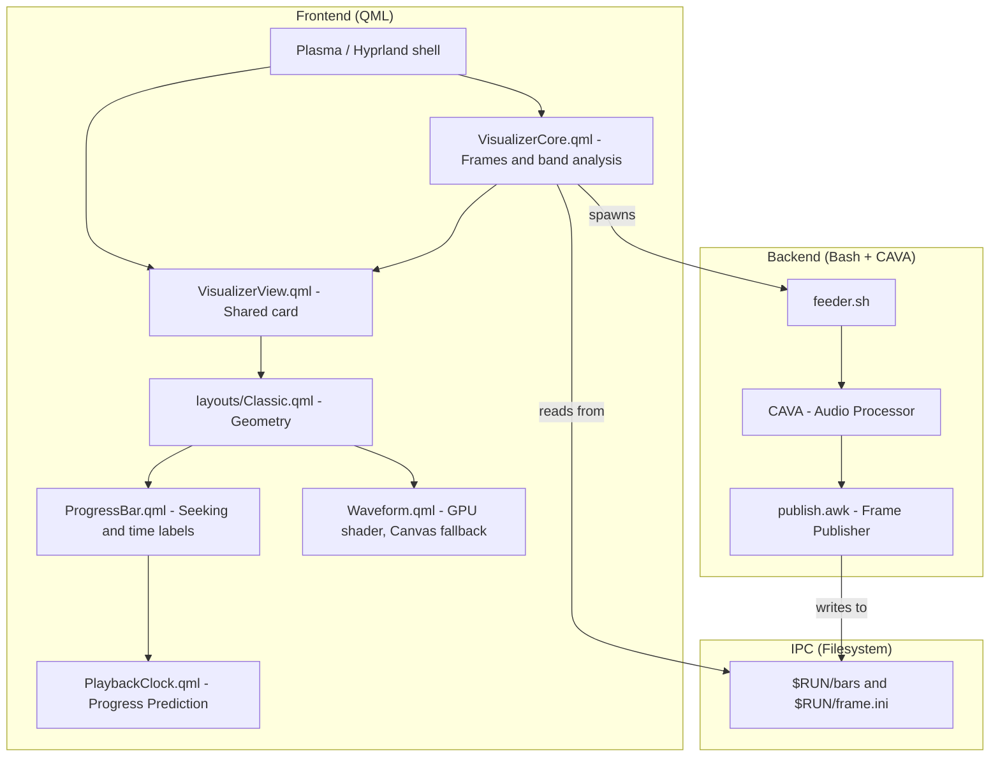

# Widget Workflow & Architecture

## Component Overview

The widget is split into three main layers: the **QML Frontend**, the **IPC Layer**, and the **Audio Backend**.

Plasma's `main.qml` and Hyprland's `AudioVisualizerShell.qml` both render
`VisualizerView.qml`. The view owns player metadata, artwork retention and colour
resolution. Its `Loader` selects the shared layout, currently `layouts/Classic.qml`,
which preserves both the 360 × 104 card and the 200 × 84 compact form.

The layout arranges reusable parts in `package/contents/ui/`:

| Component | Responsibility |
|---|---|
| `CardSurface.qml` | Static background image, tint, blur, rounded mask and scrim, behind the layout |
| `ArtView.qml` | Rounded thumbnail and platform-supplied fallback icon |
| `TransportDock.qml` | Transport controls and Plasma/Quickshell player method compatibility |
| `WaveArea.qml` | `Waveform` renderer and backend error messages |
| `ProgressBar.qml` | Seekbar styles, time labels and its `PlaybackClock` |
| `TrackText.qml` | Title/artist typography, elision and missing-metadata tooltip |

`ProgressBar` receives the view's audio-frame timestamp and the backend's visibility
state. Its clock advances on audio frames, with a one-second fallback during silent
playback; hiding or covering the view pauses it. None of the extracted components
adds a separate decorative animation clock.

The redesign's new configuration keys are registered in `main.xml`. Visualizer
styles and colour controls are connected; later phases add the remaining layouts
and appearance controls. Existing defaults remain unchanged,
including `alwaysVisible=false`. Hyprland reads these defaults through
`Configuration.js`, including `StringList` values as arrays, and saves only overrides.


```mermaid
graph TD
    subgraph "Frontend (QML)"
        main[Plasma / Hyprland shell]
        view[VisualizerView.qml - Shared card]
        layout[layouts/Classic.qml - Geometry]
        progress[ProgressBar.qml - Seeking and time labels]
        vis[VisualizerCore.qml - Frames and band analysis]
        canvas[Waveform.qml - GPU shader, Canvas fallback]
        clock[PlaybackClock.qml - Progress Prediction]
    end

    subgraph "IPC (Filesystem)"
        bars_file["$RUN/bars and $RUN/frame.ini"]
    end

    subgraph "Backend (Bash + CAVA)"
        feeder[feeder.sh]
        cava[CAVA - Audio Processor]
        publisher[publish.awk - Frame Publisher]
    end

    main --> vis
    main --> view
    vis --> view
    view --> layout
    layout --> canvas
    layout --> progress
    progress --> clock
    vis -- spawns --> feeder
    feeder --> cava
    cava --> publisher
    publisher -- writes to --> bars_file
    vis -- reads from --> bars_file
```

## Data Flow

The following sequence diagram shows how audio data moves from the system to your screen in real-time.

```mermaid
sequenceDiagram
    participant OS as System Audio (Pulse/Pipewire)
    participant CAVA as CAVA (via feeder.sh)
    participant FS as Runtime Directory
    participant QML as Visualizer.qml
    participant Canvas as Waveform.qml

    Note over QML, CAVA: 1. Initialization
    QML->>CAVA: Spawns feeder.sh (30s heartbeat, flock prevents duplicates)
    CAVA->>CAVA: Opens lock file & starts CAVA

    Note over OS, Canvas: 2. Real-time Processing Loop
    loop Continuous
        OS->>CAVA: Raw Audio Stream
        CAVA->>CAVA: FFT & Bar calculation
        CAVA->>FS: Writes changed frames to $RUN/bars and $RUN/frame.ini; unchanged frames refresh the timestamp once per second
    end

    loop Configured frame rate while visible, 2 FPS after 3s of silence
        QML->>FS: Reads $RUN/frame.ini in-process (QSettings, no process per frame)
        FS-->>QML: Quoted string of bar values
        QML->>QML: Parses and smooths toward the new frame
        QML->>Canvas: Triggers onBarsChanged only when bar values change
        Canvas->>Canvas: Uploads levels to the shader (Canvas fallback repaints)
    end
```

## Detailed Process breakdown

### 1. The Feeder (`feeder.sh`)
The feeder script acts as a bridge. It uses `cava` to process system audio and outputs raw data. It ensures only one instance of CAVA is running by using `flock`. `$RUN` is `${XDG_RUNTIME_DIR:-/tmp}/audio-wave-widget`.

`bars` keeps its original semicolon format for installed widgets. `frame.ini` holds
`t=<Unix time in seconds>`, `v="<semicolon-separated bars>"` and `protocol=2` for
in-process QSettings reads; quoting keeps the payload a single string. Older
comma-separated INI frames are still accepted. Changed frames are written
immediately; identical frames leave `bars` untouched and refresh `frame.ini` once per
second, so the reader can tell a quiet feeder from a dead one. If the INI file is
missing or its timestamp is at least two seconds old, the reader falls back to the
original `bars` file. This lets old and new widgets share a feeder without forcing a
restart on startup.

Bash handles the first frame (probing and status), then hands the rest of cava's
stream to `publish.awk`: Bash's `read` costs a syscall per byte on a pipe, awk reads
in blocks. Only an awk with `systime()` is used, and mawk, the default on
Debian/Ubuntu, runs with `-W interactive`, because otherwise it waits for a full read
buffer before handling a line. Without a usable awk (e.g. one-true-awk) the Bash loop
keeps publishing.

It also **probes input backends**. cava is compiled with a fixed set of them and distros do
not agree on which ones, so a hardcoded `method = pipewire` silently produces nothing on a
build without PipeWire support, or on a machine where the sound server is not reachable.
With the input method left on `auto` the feeder tries `pipewire`, `pulse`, then `alsa`, and
keeps the first one that emits a frame within `PROBE_TIMEOUT` seconds (cava emits frames
continuously even in silence, so "no output at all" is a reliable failure signal). The
winner is cached in `$RUN/input-method` so restarts skip the probe.

Status and diagnostics files make failures visible:

| File | Contents |
|---|---|
| `$RUN/status` | `ok <method>`, `probing <method>`, or `error <code> [detail]` |
| `$RUN/status.ini` | The same line as a quoted `v` value, for in-process reads |
| `$RUN/publisher` | Which reader publishes frames: `awk`, `awk -W interactive`, or `bash` |
| `$RUN/cava.log` | stderr of cava and the publisher, for when capture fails |

Error codes: `no-cava` (binary missing), `no-backend` (every candidate failed),
`cava-exited` (a working backend died — usually transient).

`no-cava` carries a third token naming the detected package manager (`apt-get`, `pacman`,
`nix-env`, …) so the widget can print the exact install command rather than "install cava".
Detection is by binary presence, not the `/etc/os-release` ID: derivatives keep their
parent's package manager but change the ID.

### 2. The Data Handler (`VisualizerCore.qml`)

Both the Plasma `Visualizer.qml` adapter and the Hyprland shell use this core. It
is responsible for:

- Starting the feeder script.
- Reading frames while the widget is shown; `main.qml` deactivates it while the widget
  is hidden (no player and "always visible" off).
- Following actual audio independently of MPRIS playback state. Capture stays
  available so audio from apps without media controls can wake the wave.
- Polling at 2 FPS after sustained silence or missing data, and snapping settled
  values to their target; repeated settled frames do not emit `barsChanged` or repaint
  the canvas.
- Reading status every 4s and exposing `backendFailed` / `backendMessage` /
  `backendHint`, which `main.qml` renders in place of the waveform. A `cava-exited` state
  triggers an immediate respawn (the `flock` makes a redundant spawn a no-op) and is only
  reported to the user if it persists for ~12s. While protocol-2 frames are fresh, status
  comes from `status.ini` in-process; otherwise from `status` via `cat`. Frame polling
  pauses while the backend has failed, and the status checks keep running to recover.
- Respawning the feeder every 30s unless fresh frames show it is alive.
- Restarting the feeder when settings change, once per burst of changes (100ms): it
  stops the feeder by the PID in `$RUN/feeder.pid` (and cava, for older feeders), waits
  for the `flock` to be released, then spawns the new one. Stopping only cava is not
  enough: during a backend probe the feeder would move on to the next backend with the
  old settings.
- Cleaning up the feeder process when the widget is destroyed.

#### Audio bands and attacks

Each accepted frame also publishes normalized `bass`, `mid` and `high` values in
the range 0–1. They are the mean source levels across the lowest 20%, middle 40%
and highest 40% of cava's bars, after range clamping and the existing noise gate.
Bins that straddle a boundary contribute proportionally to both bands. The split
uses the incoming bar count, before display resampling, smoothing, mirroring or
taper, so resizing the visualization cannot change the measured energy.

`bassSmoothed` follows the held bass level with a 150 ms exponential envelope.
`attack` pulses for one accepted sample when bass rises across 0.12 above that
envelope, with at least 180 ms between pulses. The envelope follows elapsed frame
time, so a sustained tone does not trigger repeatedly at low frame rates. The
first sample primes the envelope without an attack.

Analysis is published before `barsChanged` and `frameTimeMs` notify renderers. It
runs once per accepted poll using the existing frame clock; it adds no timers,
capture processes or animation loops. Repeated frames still advance the envelope
and clear attack pulses. The envelope snaps to its target within 0.0005, so settled
silence emits no energy or attack changes and retains 2 FPS polling. Malformed
reads preserve the previous state. Restart, visibility, activity and backend-failure
transitions clear the analysis; obsolete legacy reads are discarded after a reset.

`handleData(frame, timestampMs)` accepts an optional timestamp for deterministic
tests. Runtime reads use the current time; the INI's whole-second heartbeat is
used only for freshness. New visual styles consume these bands through the shared
waveform. The default Classic style keeps its existing bars and appearance.

For styles with decorative motion and for moving colour modes, accepted audible
frames also advance `frameTimeMs` when bar smoothing has settled. Default styles
keep their previous suppression of identical frames; settled silence still stops
the clock. `WaveMotion.qml` uses that timestamp to update shared peak caps, at most
32 particles and at most 4 ripples. It advances once per timestamp, clears state
when hidden/inactive, and does not own an animation timer. Reduced motion freezes
decorative phases and colour drift and disables particles and ripples.

### 3. The Renderer (`Waveform.qml`)
`Waveform.qml` draws the selected style with `WaveShader.qml` wherever Qt Quick runs
shaders, and with `WaveCanvas.qml` on the software scene graph, which ignores
`ShaderEffect`. The `simpleRender` option also selects Canvas explicitly.

`WaveShader` selects a shader family when the style changes. `visualizer.frag`
retains styles 0–5; `viz_linear.frag`, `viz_radial.frag`, `viz_particles.frag` and
`viz_ribbon.frag` implement styles 6–15. All families share `viz_common.glsl`.
The tapered levels travel four per `vec4`, since `ShaderEffect` has no array
uniforms. An audio frame updates uniforms without a CPU rasterisation, texture
upload or blur pass. Legacy glow retains its fitted Gaussian profile; new styles
approximate the prototype's browser shadows within a bounded rendering cost.
`tests/tst_rendererparity.qml` compares both renderers on a GPU scene graph.

After editing a `.frag` or the common prelude, rebuild every runtime package:

```sh
make shaders
python3 package/contents/shaders/build_shaders.py --check
```

`make shaders` uses `qsb` on `PATH`, or enters the Nix development environment.
The build script combines the common prelude with each family before compiling.
Commit the changed sources and their generated `.frag.qsb` files together.
These packages ship in the repository so users do not need `qsb`. Packaging does
not rebuild them, and a missing `.qsb` does not trigger the Canvas fallback.

When `qsb` is on `PATH`, `tests/run.py` rebuilds all families in a temporary directory
and compares their bytes with the checked-in `.qsb` files; a mismatch fails the test.
Without `qsb`, this check is skipped. Use `nix develop --command python3 tests/run.py`
to run with the development tools. After a nixpkgs update changes the `qsb`
version, the compiled bytes may change: run `make shaders` and commit the updated
`.qsb` if the check reports it as out of date.

`WaveCanvas` uses the HTML5-like `Canvas` API. The idle line follows `vis.hasAudio`;
MPRIS only controls track information and media controls. Colors, edge tapers and
fill gradients are recomputed only when their inputs change, and both renderers skip
work while hidden, idle, or showing a backend error.

`PlaybackClock.qml` predicts the playback position between MPRIS updates, since MPRIS
does not signal position during normal playback. The shared progress bar ticks it
on audio frames and sets its fallback interval to one second. Both paths run only
while the progress bar is visible and playing; a bar that becomes visible catches
up at once. The waveform seekbar repaints when its playhead crosses a pixel or
appears/disappears at an endpoint.

## Regression checks

Run `nix develop --command python3 tests/run.py`, or `python3 tests/run.py` with Qt 6
`qmltestrunner` on `PATH`. The tests run the real feeder with a synthetic cava in an
isolated runtime directory, once for each awk found on `PATH` (gawk, mawk, busybox,
nawk) plus an unusable one, and the actual QML components with a stub executable
engine. They cover changing and repeated frames, the heartbeat, legacy compatibility
and the stale-file fallback, silence settling and wakeup, joining an existing feeder,
backend fallthrough and failure recovery, coalesced settings, a restart during a
backend probe, all 16 canvas styles, what the shader receives, and playback
prediction. Band-analysis tests cover fractional frequency splits, source/display
count differences, attack timing, envelope settling, malformed reads and capture
resets; the live synthetic feeder also verifies band changes without frame-related
process launches. They do not access the desktop or sound server. CI runs them in
`.github/workflows/tests.yml`. The renderer parity check needs a GPU scene graph and
skips itself there; on a desktop run `qmltestrunner -input tests/tst_rendererparity.qml`.

For refactors that must preserve the card's appearance, compare the working tree
against a Git revision or a saved copy of `VisualizerView.qml`:

```sh
python3 tools/compare_view_snapshots.py --baseline-ref <revision>
python3 tools/compare_view_snapshots.py --baseline-view /tmp/VisualizerView.qml
```

The comparison renders both versions with identical inputs in the same process,
freezes the playback clock, and checks exact pixels across Classic/compact sizes,
artwork, backgrounds, metadata states, and all existing visualizer/progress styles.
It saves before/after PNGs and defaults to the software backend. Use
`--backend opengl --platform xcb` (or `wayland`) on a desktop to validate artwork
masks, blur and GPU effects too. Software snapshots cannot validate those effects.

### Compare new visualizers with the HTML prototype

`tools/compare_html_visualizers.py` reads `drawWave` and its colour helpers directly
from `docs/website/index.html` (or `docs/website/app.js`), including when that local reference is ignored by Git.
Use `--html /path/to/index.html` if the reference is elsewhere. It fixes the final
bar levels, bass/mid/high bands, time, peaks, particles and ripples on both sides;
synthetic audio smoothing and random particle creation are bypassed. This isolates
drawing from capture and animation timing.

Run the exact source comparison without a desktop:

```sh
python3 tools/compare_html_visualizers.py --reference qt \
  --output /tmp/audio-html-comparison
```

The default 30 cases cover styles 6–15 at 320 × 64 and 64 × 20, plus palette colours
with hue movement. All 30 currently produce identical PNGs with bloom disabled.
The reference uses Qt Canvas with adapters for browser colour and path APIs, so
this proves agreement with the HTML drawing formulas on the same rasterizer.
It does not prove identical Chromium pixels or GPU bloom. Styles 0–5 preserve their
existing appearance and intentionally remain outside this HTML comparison.

Use `--extended` to add cover colours, rainbow colours and downward bars; all 53
extended source cases currently match exactly. Every run
saves `fixtures.json`, the reference HTML, PNG pairs, absolute difference images,
`metrics.json` and a side-by-side `report.html`. Qt source comparisons require zero
pixel error by default. `--max-rmse` sets a reviewed tolerance in normalized RGB
units; a nonzero error is never an exact match.

For the actual browser and shader comparison, run on a desktop with Chromium or
Chrome, Qt 6 and an OpenGL scene graph:

```sh
python3 tools/compare_html_visualizers.py --reference chromium \
  --backend opengl --platform xcb --renderer shader --glow \
  --output /tmp/audio-browser-comparison
```

Use `--platform wayland` for a Wayland session, `--browser /path/to/chromium` to
select a browser, and omit `--glow` to isolate geometry and colours. Browser mode
preserves the original browser PNGs and measures differences without assigning an
arbitrary passing threshold. Browser execution currently fails in the restricted
development environment because a socket operation is denied; GPU rendering is
also unavailable there. The script reports a failed launch or software fallback
as an incomplete comparison, and saves the browser error log.

`--reduced-motion` audits a deliberate difference: the widget freezes decorative
phases and hue changes, while the prototype keeps some of them moving. Those cases
are not expected to match the prototype at a nonzero timestamp. Use this option
with an explicit tolerance to inspect the differences; it is separate from the
default exact source check.

CI also runs the Quickshell audio, settings persistence and launcher lifecycle
integration tests. Run the same checks locally with:

```sh
nix develop --command dbus-run-session -- python3 tests/test_quickshell.py
nix develop --command dbus-run-session -- python3 tests/test_hyprland_settings.py
nix develop --command dbus-run-session -- python3 tests/test_lifecycle_power.py
```

These use offscreen rendering, synthetic audio and private runtime directories
and session buses; no running desktop or sound server is required.

## Shared studio assets and the browser demo

The settings page is Qt Quick/QML. GitHub Pages serves the HTML/JavaScript demo
in `docs/website/index.html`. They have separate controls and rendering implementations;
the browser does not run the installed settings page or change desktop settings.
The browser demo uses one desktop/panel presentation, without a platform toggle.

Both now use the tab, wallpaper and Midnight Marina interface palette in
`package/contents/ui/studio/StudioCatalog.js`, plus the exact same wallpaper files
in `package/contents/ui/studio/wallpapers`. The catalogue retains stable backdrop
IDs so existing presets keep selecting the corresponding scene. QML loads static
images at bounded decode sizes; no wallpaper animation timer is needed.

After editing the catalogue or wallpapers:

```sh
python3 tools/sync_studio_assets.py
python3 tools/sync_studio_assets.py --check
```

Commit only the sources. `docs/website/assets/studio` is an ignored build output, so
each wallpaper and the catalogue have one tracked copy. Run `make docs` before
opening `docs/website/index.html` locally. Both `make test` and the Pages workflow build
these outputs and check byte-for-byte agreement. Pages publishes only `docs/website`,
so the deployed demo also works without repository-relative imports.
See the wallpaper directory's README for provenance and theme inspiration.

Embedding the actual QML interface would require a separate
[Qt for WebAssembly build](https://doc.qt.io/qt-6/wasm.html), browser-compatible
imports and adapters for desktop services. That is not part of this static demo.

### Plasma card sizing

Plasma owns the outer widget rectangle and can retain the size of the previous
layout. `main.qml` supplies the preset's preferred dimensions and uses
`FittedFrame.qml` to scale the complete card uniformly inside the allocated
space. This preserves the preview proportions, typography and click targets
when changing between horizontal cards and Orbit, while allowing manual resizing.
It does not forcibly resize or reposition Plasma's containment. The preview's
Fit zoom can also make the same card appear physically smaller than on desktop.

The studio uses neutral charcoal surfaces with Midnight Marina accents across
hosts. Aqua/cyan highlights are reserved for buttons, switches, sliders and
selected controls. `Theme.js`
reads the shared catalogue; the browser build emits CSS variables from it,
converting QML ARGB colours to CSS RGBA. This palette styles the settings UI;
the widget still has its own System accent, cover accent and custom colours.

## Share a look between the demo and widget

In either interface, open **My presets** and use **Copy as JSON** (HTML calls it
**Copy current as JSON**). In the other interface, choose **Import JSON** and
paste it. In QML, select the imported tile, then click **Apply** or **OK**.
Disable **Keep my colours** when you want to import the look's colours too.
The separate **Copy config** button is not the preset exchange format.

`studio/PresetCodec.js` is shared by both interfaces through the asset build.
New exports contain all current known look values, a format identifier and version,
so differing defaults do not silently change the look. The converter translates
Compact/album-art picker aliases and track-detail lists. Legacy named presets
and bare settings maps still import. Placement and the saved preset library are
excluded, unknown settings are ignored, and malformed values are rejected.
The two renderers and sample/current tracks can still look different.

Regression checks: `tests/tst_presetcodec.qml` with qmltestrunner, and
`node tests/test_preset_exchange.cjs` from the repository root. The Node check
uses the actual HTML defaults and widget `main.xml`, without needing a browser.

## Gallery and retry checks

`make gallery` captures the real QML presets and settings studio directly into
`readme/`, using `tools/capture_gallery.py` and `readme/Capture.qml.in`.
It requires Python 3 and Qt 6 qmltestrunner from the development shell.
Every preset is still rendered and validated on its own, but the published images
are seven *sheets*: four presets laid out side by side on one shared wallpaper and
grabbed as a single 2× capture, so nothing is rescaled or pasted together later.
`SHEETS` in `tools/capture_gallery.py` defines the groups — the run fails if a
preset is missing from them or listed twice, so adding a preset to `Schema.js`
forces a decision about where it belongs. The script also regenerates
[gallery.md](gallery.md) from the preset names and notes; edit the generator, not
that page. Only `classic`, `liquid` and the studio stay as single captures for the
README. The full-resolution package icon supplies the sample cover. `captures.json`
records the renderer and pixel dimensions. Files are published only after all
captures pass, and stale per-preset PNGs are removed.
The default software backend works headlessly. For GPU effects on a desktop use
`make gallery GALLERY_FLAGS="--backend opengl --platform wayland"` (or `xcb`).

`make parity` now runs the existing waveform thresholds and ten Orbit captures.
Orbit reports pixel differences and saves `/tmp/orbit-*-canvas.png` and
`/tmp/orbit-*-shader.png`; those measurements require visual acceptance on a GPU.
The Orbit Canvas loader is inactive while its shader is in use. Motion stays on
audio timestamps, sparks cap at 32, and shader failure/software/Simple render
falls back to Canvas. `make shaders` includes Orbit and the marquee fade shader.

The retry audit found that Qt Canvas supports
[native soft-light and overlay composition](https://doc.qt.io/qt-6/qml-qtquick-context2d.html#globalCompositeOperation-prop)
under `qt-soft-light` and `qt-overlay`. These can blend with material pixels in
the same canvas; a separate layer cannot blend with desktop pixels it never receives.
Perspective tilt uses a [Matrix4x4 transform](https://doc.qt.io/qt-6/qml-qtquick-matrix4x4.html)
while input stays on the untransformed parent. The lightbox is a transient window.
